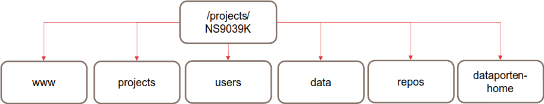
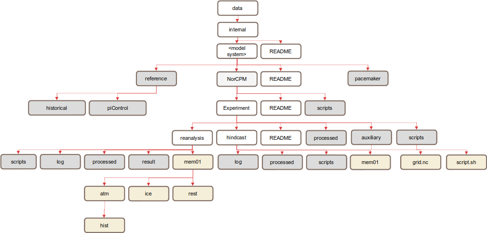
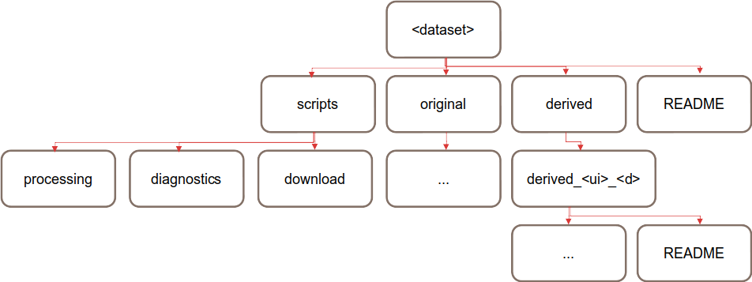

Storage structure
=================

This page is documentation of the BCPU storage space on NIRD.

Status of restructure
---------------------

We are currently in the process of creating and migrating to a new directory
structure to hold the contents of the NS9039K project space.

Top-level structure
-------------------

A high-level structure diagram is included below to demonstrate the top-level
directories. This includes the directories **data**, **users**,
**projects**, **repos** and **www**.

        described in the next section.

  The top-level data structure.

The purpose and structure of each of these directories is described in their
respective sections of this document.

Data directory
--------------

The purpose of the **data** directory is to house data that we use within the
BCPU. All datasets should be stored and documented here, following the
best practices outlined on this page. This includes derived datasets, which are
datasets to which the user has done some amount of processing, but that might
still be useful for other users. Note that the **data** directory has a
regulated structure, and so when making changes within this
space, the rules and recommendations on this page should be followed.

The data structure is composed of *collections* and *datasets*.

A *collection* is a directory that contains other *collections* and/or
*datasets*. It should contain a README.json based on the template, and
indicate that the directory is a *collection* by having a value of
isCollection:1.

A *dataset* can contain multiple sub-directories for different variables,
time aggregations or ensemble members. It should contain a README.json based
on the template, and indicate that the directory is a *dataset* by having
a value of isDataset:1.

The data directory contains two top-level directories; **external** and
**internal**. The **external** directory is for model, reanalysis or
obervational data which we have downloaded from an external source,
for example, the ERA5 reanalysis. The **internal** directory is for experiments
which have been run "in-house", for example, the output from running a new
NorCPM experiment.

.. figure::
  general_data.png
  :name: general-data
  :width: 800
  :alt: An image of the general structure of the data directory.

  General structure of the data directory

The general rules that accompany this structure are as follows:

#. Data must have the same number of directory levels as in
   :numref:`general-data`. If there is a stand-alone
   experiment/dataset, it should still be placed in an
   "Experiment collection" or "Data provider" collection directory even if it is
   the only experiment/dataset in the collection. There should never be a
   mixture of collections and datasets in one directory.

#. As shown in :numref:`general-data`, each collection and dataset
   directory must contain a README which follows the README template.

#. Data must be contained in a sub-directory of the dataset level, rather than
   alongside the README and any other directories. For example,
   the experiment/dataset may have a large number of ensembles, and these
   should be organized into one or more sub-directories so as to make the
   other files in the experiment more discoverable, recommendations for these
   names are included in the following two sections.

Internal data
#############

We have designed some rules and some recommendations for organizing data from
our internal experiments. The general structure of the **internal** directory
can be seen in :numref:`general-data`.

In this structure diagram, there are several required directory layers;
**Model system**, **Experiment collection** and **Experiment**,
these are all defined as follows:

.. figure::
  im_model_system.png
  :name: im-model-system
  :figwidth: 10%
  :width: 100
  :align: left

**Model system**: the version of the Earth System Model used to carry out
experiments. Different model systems are defined by having different reference
(historical or piControl) runs.

**Experiment collection**: a group of experiments which have some
similarity, usually if a user is running a set of experiments, they would create
their own experiment collection to hold all these experiments together.

.. figure::
  im_experiment.png
  :name: im-experiment
  :figwidth: 10%
  :width: 100
  :align: left

**Experiment**: a single dataset with, for example, a particular forcing or data
assimilation scheme.

:numref:`internal-dataset` shows an example for the internal data
structure for one model system.
We have provided some recommended directory names in grey and some example
sub-directories in gold to complement the
general structure. These should be used where possible and appropriate.

  Example structure of an internal dataset

Some notes on this example:

#. Where there are NorCPM runs, place them into an 'experiment collection'
   named **NorCPM**.

#. For NorCPM experiments, create separate directories **hindcast**
   and **reanalysis**.

#. Use a **reference** directory to store reference experiments for a model
   system, including **historical** and **piControl** runs.

Internal dataset sub-directories:

External data
#############

The general structure of the **external** directory is similar to that of the
**internal** one, it is divided into directories for **Data type**,
**Data provider** and **Dataset** as seen in :numref:`general-data`.
These terms are defined as follows:

**Data type**: a collection based on the nature of the data, in practice there
are three directories; **observation**, **reanalysis** and **model**.

**Data provider**: a collection of datasets that are grouped based on data
provider. This could be a centre (e.g. ECMWF or NOAA), or a multi-centre
project (e.g. CMIP).

**Dataset**: this is an individual experiment (e.g. rcp45), reanalysis product
(e.g. ERA5), or observational records.

External dataset sub-directories:

  The structure of an external dataset

**original**: this is where the original data downloaded from the external
source should be kept. This data does not have to be completely unmodified, for
example, it could be compressed, or the file format could be converted.

**derived/<ui>_<d>**: this is where datasets that have undergone some
significant changes (e.g. regridding) should be stored. It is recommended to
name sub-directories with <ui> as user initials (e.g. tb) and <d> as
a brief description (e.g. 1x1).

**scripts**: code used for downloading the data, preprocessing the data, or
even diagnostic scripts can exist in this directory of the data structure.

Users directory
---------------

personal code, plots and other files belonging to a user should be
placed in a directory within **users/**. It is recommended that the name of a
user's directory matches their username. The structure of individual user
directories is not regulated, and this space can be organized to the user's
convenience.

Projects directory
------------------

projects can contain data, scripts and outputs, and it may be
convenient to store these related files in one directory, in this case a
directory named after the project can be placed in the **projects/** directory.
The organization of these spaces is the responsibility of the project manager.

Repos directory
---------------

local copies of shared Git repositories will reside here, there
is a version of all of these files within the BjerknesCPU GitHub.

www directory
-------------

this directory contains files to be accessible through the web
interface at http://ns9039k.web.sigma2.no/.

More information
----------------

For further information, or if you are having issues with the new data
structure, please contact BCPU-support, or make an issue in the
BjerknesCPU/BCPU-support GitHub repository.
