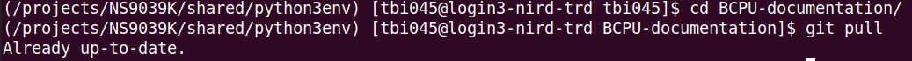
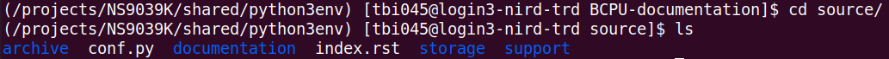
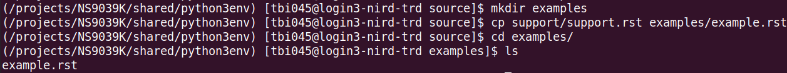
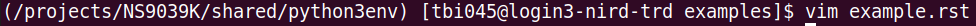
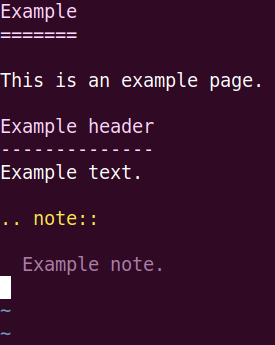
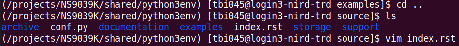
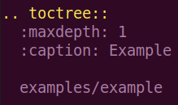

Contribute documentation
========================

This page describes the process of contributing to this documentation. This is
a good place to place documentation on datasets, software or projects within the
BCPU. There is a simple six-step workflow described in the first section,
and there are more detailed notes on each step to guide you through the process.

Six steps to contribute documentation
-------------------------------------

#. Git clone the
   `BCPU-documentation <https://github.com/BjerknesCPU/BCPU-documentation>`_
   repository to NIRD in your user directory in
   the location /project/NS9039K/www/<user>/.

#. Make changes or add documentation files in the source directory
   (BCPU-documentation/source).

#. In the root directory (BCPU-documentation/) call the command ``make github``
   which will build html files and put them into the docs/ directory.

#. Check your changes `here <http://ns9039k.web.sigma2.no>`_
   before pushing them to GitHub.

#. Add, commit and push your changes to GitHub.

#. See the published changes
   `online <https://bjerknescpu.github.io/BCPU-documentation/>`_
   (this can take a couple of minutes to update).

Cloning the GitHub repository
#############################

You only need to do this step the first time you modify the documentation.

You should clone the GitHub repository to NIRD so that you have all the tools
available for this workflow. First navigate to /projects/NS9039K/www/<user>
where <user> is a user directory owned by you. If you do not have a directory
in /projects/NS9039K/www/ then create one with your name, username or initials.

Once you are in this directory, clone the repository with the command
``git clone ssh://git@github.com/BjerknesCPU/BCPU-documentation.git``
which will produce a directory 'BCPU-documentation/' in your current working
directory. Change directory into this directory.

For more on cloning, see this
`page <https://docs.github.com/en/repositories/creating-and-managing-repositories/cloning-a-repository>`_.
If you have never used the organisational GitHub before, you may have to
`set up ssh keys <https://docs.github.com/en/enterprise-server@3.0/authentication/connecting-to-github-with-ssh/adding-a-new-ssh-key-to-your-github-account>`_.
If you have issues with this step, or with access to the GitHub repository,
please contact our :doc:`internal support <../support/support>`.

Making changes to the documentation files
#########################################

Within the BCPU-documentation/ directory, all changes are made to the 'source'
which exists within the source/ directory. In this documentation, the source
files are written in reStructuredText, which is a type of markup. Writing in
this format allows the build files to be automatically generated from the
source files.

Here is an introduction to
`reStructuredText <https://docutils.sourceforge.io/docs/user/rst/quickstart.html>`_
but an easy way of getting started is to copy the format of existing
documentation in the source directory.

Each page on the
documentation `site <https://bjerknescpu.github.io/BCPU-documentation/>`_
corresponds to one .rst file in the source directory. These .rst files are
organised into 'categories', for example 'storage' or 'support'.

If you wish to modify an existing documentation page, you need to locate the
.rst file for the page in the source directory, and then make modifications
there.

If you wish to add a new documentation page, follow this example in which we
will be adding a new documentation category called 'Examples' and
a new page called 'Example page'. The 'caption' refers to the category, and
the filename is entered as its path from the source directory, but without the
'.rst' extension. 

1. Make sure that you have the latest version of the documentation,
   so run the command ``git pull`` in the BCPU-documentation/ directory.

2. Move into the source/ directory.

3. Make a new category (if you are adding a page to an existing category, then
   just change directory into this category). In this example we will make a
   category directory called 'examples'.

4. Copy an existing documentation page and rename it to a name of your choice.
   In this example, the file will be named 'example.rst'.

5. Modify the new file to add your content to it.

6. Because a new page has been added, we need to add a link to the page on
   the index page (index.rst). To do this, change directory to
   BCPU-documentation/source/ and add the new page to the index.rst file.

Build the documentation
#######################

The documentation is built using
`Sphinx <https://www.sphinx-doc.org/en/master/>`_. In order to use Sphinx, you
will need to load an environment which contains the library. On NIRD, this is
our shared conda environment, which can be activated as follows:

.. code-block:: bash

  $ source /opt/anaconda3/etc/profile.d/conda.sh
  $ conda activate /projects/NS9039K/shared/python3env

The documentation is built by calling: ``make github`` in the
BCPU-documentation/ directory.

This will use the files in the source/ directory to generate html files in the
build/ directory. These are then automatically copied to the docs/ directory,
which is where the documentation is read from for the website. These
changes are not applied to our documentation website until we push back to
GitHub. Have a look at your changes before you make them visible to
everyone else (see next step).

Check your changes
##################

Once you have run the ``make github`` command, the built files should be
available in the docs/ directory. It is good practice to view these
files before pushing them to GitHub. Because you have been working in the
project www/ directory, you can check these files
`here <http://ns9039k.web.sigma2.no>`_. In the web interface, navigate into
your user directory, and open the file 'index.rst', which is the index page
of the documentation. From here you should be able to check what the
documentation looks like before you push it to our shared website.

Add, commit and push your changes
#################################

Use git to push your changes to our shared website.

* Change into the BCPU-documentation/ directory.
* Run the command ``git pull`` to make sure you have the most up to date
  version of the documentation.
* Run the command ``git add -A`` which will stage all your changes.
* Run the command ``git commit -m "<MESSAGE>"`` but replace <MESSAGE> with
  a brief description of your changes, for example "Added Support documentation
  page".
* Run the command ``git push`` which will push your changes to the remote
  repository, which will automatically update the GitHub documentation page.

Once you have done this, the
`online pages <https://bjerknescpu.github.io/BCPU-documentation/>`_ should
automatically update after 1-2 minutes.
