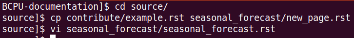
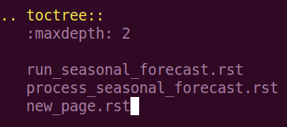
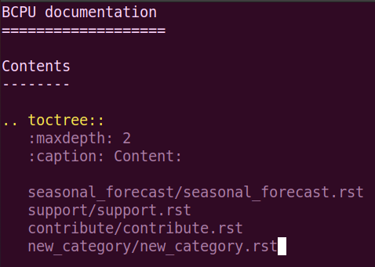

Contribute documentation
========================

This page describes the process of contributing to this documentation. This is
a good place to place documentation on software or projects within the
BCPU. There is a simple six-step workflow described in this first section,
and there are more detailed notes on each step to guide you through the process.

1. Get the up-to-date code.  
     
   | 1.1. If this is your first time contributing to the documentation, clone the GitHub repository.
   | 1.2. If not, then pull the most up-to-date documentation.

2. Make changes to the documentation files in the source directory, either:
    
   | 2.1. Modify an existing page.
   | 2.2. Add a new page to an existing category.
   | 2.3. Add a new category.

3. Build the documentation in the root directory.
4. Check your changes before pushing them to GitHub.
5. Add, commit and push your changes to GitHub.
6. See the published changes.

1.1. Clone the GitHub repository
--------------------------------
If this is the first time you contribute to the documentation.

This will need to clone the repository `BCPU-documentation <https://github.com/BjerknesCPU/BCPU-documentation>`_.

You should clone the GitHub repository to NIRD so that you have all the tools
available for this workflow. First navigate to /projects/NS9039K/www/<user>
where <user> is a user directory owned by you. If you do not have a directory
in /projects/NS9039K/www/ then create one with your name, username or initials.

Once you are in this directory, clone the repository with the command
``git clone git@github.com:BjerknesCPU/BCPU-documentation.git``
which will produce a directory 'BCPU-documentation/' in your current working
directory. Change directory into this directory.

For more on cloning, see this
`page <https://docs.github.com/en/repositories/creating-and-managing-repositories/cloning-a-repository>`_.
If you have never used the organisational GitHub before, you may have to
`set up ssh keys <https://docs.github.com/en/enterprise-server@3.0/authentication/connecting-to-github-with-ssh/adding-a-new-ssh-key-to-your-github-account>`_.
If you have issues with this step, or with access to the GitHub repository,
please contact our :doc:`internal support <../support/support>`.

1.2. Pull the most up-to-date documentation 
-------------------------------------------

If this is not your first time contributing to documentation. 

In your local directory of the Git repository (by standard named BCPU-documentation) switch to the main branch. ::

  git checkout main 

Then pull the remote main branch. :: 

  git pull origin main

2.1. Modify an existing page
----------------------------

Within the BCPU-documentation/ directory, all changes are made to the 'source'
which exists within the source/ directory. In this documentation, the source
files are written in reStructuredText, which is a type of markup. Writing in
this format allows the build files to be automatically generated from the
source files.

Here is an introduction to
`reStructuredText <https://docutils.sourceforge.io/docs/user/rst/quickstart.html>`_
but an easy way of getting started is to copy the format of existing
documentation in the source directory. 

Each page on the
documentation `site <https://bjerknescpu.github.io/BCPU-documentation/>`_
corresponds to one .rst file in the source directory. These .rst files are
organised into 'categories', for example 'storage' or 'support'.

If you wish to modify an existing documentation page, you need to locate the
.rst file for the page in the source directory, and then make make modifications
to the text in the file. 

2.2. Add a new page to an existing category
-------------------------------------------

If you wish to add a new documentation page, follow the following steps, 
we will use the template file: source/contribute/example.rst. 

1. Copy and rename the example template into your desired destination category, 
   for example if you want to make a new documentation page about the 
   seasonal forecast: ``cp source/contribute/example.rst source/seasonal_forecast/new_page.rst``

2. Add text to this file, as desired.  

3. Once you are happy with the file, you need to add a link to the file in the category index.
   This should be a .rst file with the same name as the category.

Add the new page to the toctree directive.  

2.3. Add a new category
-----------------------

If you want to create a new category for documentation, then follow these steps:

1. Create a new directory in source/ ``cd source``  to hold pages on the new category ``mkdir new_category``. 

2. Copy the index page template for the new category ``cp contribute/example_index.rst new_category/new_category.rst``. 

3. Add new documentation page links to the toctree directive (as in previous example). 

4. Add the new category to the first section of the master index tree source/index.rst.

3. Build the documentation
--------------------------

The documentation is built using
`Sphinx <https://www.sphinx-doc.org/en/master/>`_. In order to use Sphinx, you
will need to load an environment which contains the library. On NIRD, this is
our shared conda environment, which can be activated as follows:

.. code-block:: bash

  $ source /nird/home/pgchiu/mamba/py3env2.bash

The documentation is built by calling: ``make github`` in the
BCPU-documentation/ directory.

This will use the files in the source/ directory to generate html files in the
build/ directory. These are then automatically copied to the docs/ directory,
which is where the documentation is read from for the website. These
changes are not applied to our documentation website until we push back to
GitHub. Have a look at your changes before you make them visible to
everyone else (see next step).

4. Check your changes
---------------------

Once you have run the ``make github`` command, the built files should be
available in the docs/ directory. It is good practice to view these
files before pushing them to GitHub. Because you have been working in the
project www/ directory, you can check these files
`here <http://ns9039k.web.sigma2.no>`_. In the web interface, navigate into
your user directory, and open the file 'index.rst', which is the index page
of the documentation. From here you should be able to check what the
documentation looks like before you push it to our shared website.

5. Add, commit and push your changes
------------------------------------

Use git to push your changes to our shared website.

* Change into the BCPU-documentation/ directory.
* Run the command ``git pull`` to make sure you have the most up to date
  version of the documentation.
* Run the command ``git add -A`` which will stage all your changes.
* Run the command ``git commit -m "<MESSAGE>"`` but replace <MESSAGE> with
  a brief description of your changes, for example "Added Support documentation
  page".
* Run the command ``git push`` which will push your changes to the remote
  repository, which will automatically update the GitHub documentation page.

6. See the published changes
----------------------------

Once you have done pushed the changes to the GitHub, the
`online pages <https://bjerknescpu.github.io/BCPU-documentation/>`_ should
automatically update after 1-2 minutes (this is not immediate). 
